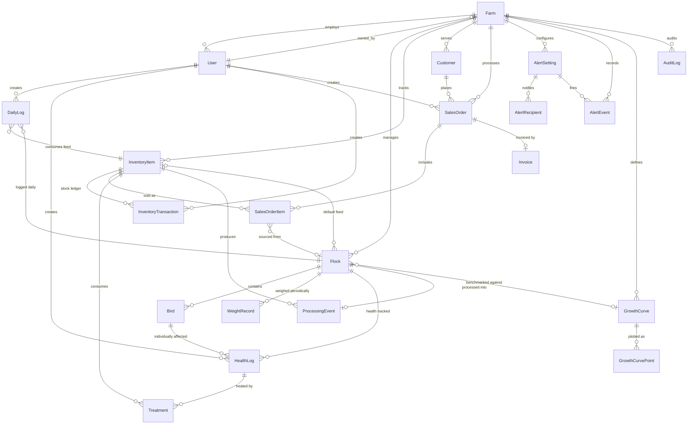

# DATABASE.md: PoultryPilot

> **Revision 2.** This supersedes the original schema. See [GAPS.md](GAPS.md) for the full list of
> issues that drove these changes, and the [Changelog](#changelog-v1--v2) at the end of this file
> for a summary of what moved.
>
> **Platform revision (2026-07-20):** the stack moved to **Vercel + Supabase**. Auth is Supabase
> Auth, not Clerk; the backend is Next.js Route Handlers, not NestJS. See
> [§ Supabase Integration](#supabase-integration) for connection pooling, the identity link, and the
> user-provisioning trigger.
>
> Four design decisions are baked into this revision:
> 1. **Auth is delegated, not local.** No password column; `authUserId` links to `auth.users`.
> 2. **Production auto-posts to inventory.** Eggs and processed broilers become real `PRODUCT` stock.
> 3. **Withdrawal periods are enforced,** not just recorded. Sales are blocked during withdrawal.
> 4. **Costing is weighted-average,** snapshotted per transaction so historical reports are stable.

## Conventions

| Concern | Convention | Rationale |
|:---|:---|:---|
| **Money** | `Decimal @db.Decimal(12, 2)` | Never `Float`. Binary floating point cannot represent currency exactly; `0.1 + 0.2 != 0.3` in an invoice total is a real defect. |
| **Unit costs** | `Decimal @db.Decimal(12, 4)` | Feed is priced per-kg at sub-cent precision; rounding at 2dp compounds across a 45-day cycle. |
| **Quantities** | `Decimal @db.Decimal(12, 3)` | Feed in kg, water in L, medication in ml. |
| **Counts** | `Int` | Birds, eggs, mortality. |
| **IDs** | `String @id @default(cuid())` | Opaque, sortable, safe in URLs. |
| **Dates** | `DateTime @db.Date` for calendar days, full `DateTime` for instants | `logDate` is a calendar day, not a moment. See [Timezones](#timezones). |
| **Enums in API** | Serialized as-is (`LAYER`, not `"Layer"`) | The original API.md used title-case strings that matched no enum. One vocabulary, everywhere. |
| **Soft delete** | `status`/`isActive` fields; no hard deletes on entities with history | Deleting a flock must not orphan a year of logs. |
| **Attribution** | `createdById` on every entity a user can author | Required for accountability, for the "own records" access rule, and for audit. |

### Timezones

`Farm.timezone` (IANA, e.g. `Africa/Nairobi`) is the authority for every calendar-day boundary in the
system. "Today's eggs", the `@@unique([flockId, logDate])` constraint, the 24-hour mortality window,
and the 7-day production average are **all** computed in farm-local time, then stored as UTC instants
or bare dates. Storing `logDate` as `@db.Date` means the application layer must resolve "today" in
farm time before writing — never `new Date()` on a server in another region.

### Currency

`Farm.currency` (ISO 4217, e.g. `KES`, `USD`) is set once at farm creation. All money columns are
denominated in it. There is no multi-currency support and no FX conversion; this is a deliberate v1
constraint, not an oversight.

---

## Entity Relationship Diagram



---

## Supabase Integration

### Connection strings

Vercel runs the API as serverless functions, so every invocation is a potentially new database
connection. Direct connections exhaust Postgres' connection limit quickly.

```bash
# Runtime — Supavisor transaction mode
DATABASE_URL="postgresql://…@…pooler.supabase.com:6543/postgres?pgbouncer=true&connection_limit=1"
# Migrations — direct connection
DIRECT_URL="postgresql://…@…supabase.com:5432/postgres"
```

`pgbouncer=true` disables prepared statements, which transaction mode does not support.
`connection_limit=1` is required in serverless: each function instance holds one connection rather
than a pool it will never reuse.

### Prisma 7 configuration

**Connection URLs are no longer declared in `schema.prisma`.** Prisma 7 moved them to
`prisma.config.ts`, and `PrismaClient` now requires a driver adapter:

| File | Role | Which URL |
|:---|:---|:---|
| `prisma.config.ts` | Prisma CLI — migrations | `DIRECT_URL` (5432). Migrations need session state the pooler does not preserve. |
| `src/lib/db.ts` | Runtime client, via `PrismaPg` adapter | `DATABASE_URL` (6543, pooled) |

The split falls out naturally: the CLI gets the direct connection it needs, the serverless runtime
gets the pooled one it needs.

`@prisma/adapter-pg` uses `node-pg` instead of the Rust query engine, which removes the engine binary
from the deployment bundle and **reduces cold start** — a direct improvement on G-75, which flagged
Prisma's serverless cold-start cost as unmeasured.

Prisma 7 also **no longer loads `.env` automatically**; `prisma.config.ts` imports `dotenv/config`.

### What transaction mode costs — and what it does not

This matters because the [Invariants](#invariants) below depend on transactional atomicity.

| Mechanism | Survives transaction mode? |
|:---|:---|
| `SELECT … FOR UPDATE` row locks | ✅ Yes — transaction-scoped, released at commit |
| Prisma `$transaction()` interactive callbacks | ✅ Yes — the pooler holds one backend for the transaction's life |
| **Advisory locks** (`pg_advisory_lock`) | ❌ **No** — session-scoped, lost at the transaction boundary |
| Prepared statements | ❌ No — disabled by `pgbouncer=true` |
| `SET`, temp tables, session GUCs | ❌ No |

**Consequence:** every invariant requiring a lock MUST use `SELECT … FOR UPDATE` inside a Prisma
interactive transaction. Advisory locks MUST NOT be used — they will appear to work in local
development against a direct connection and fail silently in production through the pooler.

### User provisioning

Supabase Auth writes to `auth.users`. A trigger projects that into `public.User` in the **same
transaction** — there is no webhook, no signature verification, and no window where a user is
authenticated but has no local row.

```sql
create or replace function public.handle_new_auth_user()
returns trigger language plpgsql security definer set search_path = public as $$
begin
  insert into public."User" (id, "authUserId", email, name, role, status, "farmId", "createdAt", "updatedAt")
  values (
    gen_random_uuid()::text,
    new.id,
    new.email,
    coalesce(new.raw_user_meta_data->>'name', split_part(new.email, '@', 1)),
    coalesce((new.raw_user_meta_data->>'role')::"UserRole", 'FARM_WORKER'),
    'ACTIVE',
    (new.raw_user_meta_data->>'farmId'),
    now(), now()
  )
  on conflict ("authUserId") do nothing;   -- idempotent
  return new;
end; $$;

create trigger on_auth_user_created
  after insert on auth.users
  for each row execute function public.handle_new_auth_user();
```

`role` and `farmId` travel in the invitation's `raw_user_meta_data`, set when the Admin issues the
invite. The `on conflict` clause makes re-running safe.

> **Why this is better than the webhook it replaces.** The Clerk design required a signed HTTP
> callback that could arrive late, out of order, or not at all — which forced a "Setting up your
> account…" retry state into the sign-in flow *(USER_FLOWS §1.1)*. A trigger runs in the same
> transaction as the auth insert. That state disappears entirely.

### ⚠️ Row Level Security — required, not optional

**Supabase exposes every table in the `public` schema through PostgREST at `/rest/v1/`, reachable
with the `anon` key that ships in the browser bundle.** Tables created by Prisma have RLS
**disabled** by default. Without the migration below, anyone who opens DevTools can read every
customer record, every financial figure, and every log — and write to them — completely bypassing
the RBAC specified in [BUSINESS_RULES §2.1](BUSINESS_RULES.md).

This is not a theoretical risk. The `anon` key is *designed* to be public; RLS is the only thing
standing behind it. The API-layer RBAC is a second door, not the only one.

This project authorizes in application code, not in policies *(the RLS-as-primary option was
considered and not taken)*. So the correct posture is: **enable RLS everywhere, write no policies,
and let only the service-role key through.** Prisma connects as the database owner and bypasses RLS,
so application queries are unaffected.

```sql
-- Deny-all baseline. RLS with zero policies = nothing passes except roles that
-- bypass RLS (service_role, and the owner Prisma connects as).
do $$
declare t record;
begin
  for t in
    select tablename from pg_tables where schemaname = 'public'
  loop
    execute format('alter table public.%I enable row level security', t.tablename);
    execute format('alter table public.%I force row level security', t.tablename);
  end loop;
end $$;

-- Belt and braces: revoke the Data API roles outright.
revoke all on all tables    in schema public from anon, authenticated;
revoke all on all sequences in schema public from anon, authenticated;
revoke all on all functions in schema public from anon, authenticated;

alter default privileges in schema public
  revoke all on tables from anon, authenticated;
```

> **Run this immediately after every `prisma migrate` that creates a table.** Prisma does not manage
> RLS and will not re-apply it. A new table ships with RLS off — see G-71.
>
> **The stronger alternative:** disable the Data API entirely (Dashboard → Settings → API → Data API
> → set exposed schemas to none). If nothing but Prisma ever touches this database, that closes the
> door rather than locking it. Recommended if you are confident you will not use Supabase client
> libraries directly from the frontend.

**Verify it worked** — this must return zero rows:

```sql
select tablename from pg_tables
where schemaname = 'public' and rowsecurity = false;
```

And from a browser console against the live project, this must **not** return data:

```js
const { data, error } = await supabase.from('Customer').select('*')
// expect: error, or an empty array — never customer records
```

Storage buckets need the same treatment: invoice PDFs are financial documents, and a public bucket
is a public URL.

### Scheduled jobs

Supabase includes `pg_cron`, which supplies the scheduler the previous stack lacked *(G-24)*:

```sql
-- ⚠️ pg_cron schedules in UTC, NOT in Farm.timezone. Every other time boundary in
--    this system is farm-local (BR-05); these are the exception. Convert manually.
--    Asia/Manila is UTC+8, so 06:00 local = 22:00 UTC the previous day.

select cron.schedule('low-inventory-sweep', '0 22 * * *',      -- 06:00 Asia/Manila
  $$ select public.evaluate_low_inventory_alerts() $$);

select cron.schedule('stock-reconciliation', '30 18 * * *',    -- 02:30 Asia/Manila
  $$ select public.reconcile_inventory_stock() $$);            -- asserts I-05
```

> **If `Farm.timezone` ever changes, these schedules do not follow it.** They are the one place in
> the system where a time is hardcoded rather than derived — see G-69. A comment naming the intended
> local time is mandatory on every job.

### Free-tier constraints

The project runs on Supabase's free tier by explicit decision. Two consequences are recorded here
because they affect operations, not code:

| Constraint | Effect | Mitigation |
|:---|:---|:---|
| **Pauses after 7 days without an API request** | Project suspends; needs manual resume. Daily farm use prevents it, but a quiet week between broiler cycles does not. | A scheduled keep-alive ping (see [CHANGELOG](../CHANGELOG.md)) |
| **No automated backups** | A year of production and financial records has no recovery path *(G-59)* | Scheduled `pg_dump` to versioned storage |
| 500 MB database | Ample — this schema at full scale is a few MB | — |

---

## Bootstrap Order

The original schema had a circular required foreign key — `User.farmId` and `Farm.ownerId` each
required the other, making the first insert impossible. `Farm.ownerId` is now **nullable**, which
resolves the cycle. First-run sequence:

```
1. INSERT Farm        (ownerId = NULL, timezone, currency)
2. Sign up first user (Supabase Auth → trigger inserts public.User with farmId in metadata)
3. UPDATE Farm        SET ownerId = <user>, User.role = ADMIN
```

The seed script creates the farm, then invites the first user with `farmId` and `role: ADMIN` in
their metadata so the trigger wires them up on signup. `Farm.ownerId` is nullable in the schema but
is treated as required by application logic once bootstrap completes.

---

## Table Definitions

### User

Identity is owned by **Supabase Auth** (`auth.users`). This table stores the farm-local projection:
role, status, and farm membership. It is kept in sync by a **Postgres trigger**, not a webhook —
see [§ Supabase Integration](#supabase-integration).

| Column | Type | Notes |
|:---|:---|:---|
| `id` | String | PK. |
| `authUserId` | String (uuid) | **Unique.** The link to `auth.users.id`. Set by the provisioning trigger. |
| `email` | String | Unique. Mirrored from `auth.users` for display and alert routing. |
| `name` | String | Mirrored from `auth.users.raw_user_meta_data`. |
| `role` | Enum | `ADMIN` \| `FARM_WORKER`. |
| `status` | Enum | `INVITED` \| `ACTIVE` \| `DEACTIVATED`. Was missing entirely in v1 despite the API exposing `isActive`. |
| `farmId` | String | FK → `Farm`. |
| `invitedAt` / `lastLoginAt` | DateTime? | Operational visibility for user management. |

> **No `password` column.** Authentication is entirely Supabase Auth's responsibility; credentials
> live in the `auth` schema, which this application never writes to. The v1 schema carried a hashed
> password field that contradicted its own stated stack.

### Farm

| Column | Type | Notes |
|:---|:---|:---|
| `id` | String | PK. |
| `name`, `location` | String | |
| `timezone` | String | IANA name. Authority for all day boundaries. **New.** |
| `currency` | String | ISO 4217. **New.** |
| `ownerId` | String? | **Nullable, unique.** FK → `User`. Nullable to break the bootstrap cycle. |

### Flock

| Column | Type | Notes |
|:---|:---|:---|
| `id` | String | PK. |
| `farmId` | String | FK → `Farm`. |
| `type` | Enum | `LAYER` \| `BROILER`. |
| `name` | String | Unique per farm. |
| `breed` | String? | e.g. "Ross 308". Determines which growth curve is meaningful. **New.** |
| `initialCount` | Int | Birds at start. |
| `currentCount` | Int | **Maintained by the application**, not a stored guess. See [Invariants](#invariants). |
| `startDate` | DateTime | |
| `cycleLengthDays` | Int? | Defaults to 45 for broilers, null for layers. Was a hardcoded assumption in v1. **New.** |
| `status` | Enum | `ACTIVE` \| `INACTIVE` \| `PROCESSED` \| `ARCHIVED`. Now matches BUSINESS_RULES §3. |
| `defaultFeedItemId` | String? | FK → `InventoryItem`. **Resolves the "which feed do we deduct?" blocker.** |
| `growthCurveId` | String? | FK → `GrowthCurve`. |
| `withdrawalUntil` | DateTime? | Denormalized max withdrawal end across all treatments. Blocks sales. **New.** |

### Bird

Optional individual tracking. Only populated when the flock is created with tagging enabled.

| Column | Type | Notes |
|:---|:---|:---|
| `id` | String | PK. |
| `flockId` | String | FK → `Flock`. |
| `tag` | String | **Unique per flock**, not globally. v1's `@unique` contradicted its own prose. |
| `status` | Enum | `ACTIVE` \| `CULLED` \| `SOLD` \| `DECEASED`. |
| `hatchDate` | DateTime? | |
| `notes` | String? | The API sent this field; the schema had nowhere to put it. **New.** |

### DailyLog

One row per flock per calendar day (farm-local). This is the highest-write table and the source of
truth for feed cost, production, and mortality.

| Column | Type | Notes |
|:---|:---|:---|
| `id` | String | PK. |
| `flockId` | String | FK → `Flock`. |
| `logDate` | Date | `@@unique([flockId, logDate])`. |
| `feedItemId` | String? | FK → `InventoryItem`. **Which feed was consumed.** Defaults from `Flock.defaultFeedItemId`. Nullable so a log can still be saved when feed tracking isn't configured. |
| `feedConsumedKg` | Decimal | |
| `waterConsumedL` | Decimal | Now actually used — see [Derived Metrics](#derived-metrics). |
| `mortalityCount` | Int | |
| `eggsCollected` | Int? | Layer only. |
| `crackedEggs` | Int? | Layer only. Deducted from sellable output. |
| `eggsDiscarded` | Int? | Layer only. **Eggs destroyed under medication withdrawal.** Excluded from sellable output. **New.** |
| `notes` | String? | |
| `createdById` | String | FK → `User`. **New.** |

> `avgWeightG` has moved out of this table — see `WeightRecord`. Weight is sampled weekly, not
> daily, and carrying it here forced a nullable column that was empty ~86% of the time and gave no
> place to record sample size.

### WeightRecord

**New table.** Periodic (typically weekly) average weight sampling for broiler flocks.

| Column | Type | Notes |
|:---|:---|:---|
| `id` | String | PK. |
| `flockId` | String | FK → `Flock`. |
| `recordDate` | Date | `@@unique([flockId, recordDate])`. |
| `avgWeightG` | Decimal | |
| `sampleSize` | Int | How many birds were weighed. Without it, a 3-bird sample and a 50-bird sample are indistinguishable in the growth report. |
| `createdById` | String | FK → `User`. |

### HealthLog

| Column | Type | Notes |
|:---|:---|:---|
| `id` | String | PK. |
| `flockId` | String | FK → `Flock`. |
| `birdId` | String? | FK → `Bird`. Null if flock-wide. |
| `logDate` | DateTime | |
| `eventType` | String | |
| `severity` | Enum | `MILD` \| `MODERATE` \| `SEVERE`. Collected in USER_FLOWS, absent from the v1 schema. **New.** |
| `status` | Enum | `OPEN` \| `RESOLVED`. BUSINESS_RULES defined this transition against a field that didn't exist. **New.** |
| `resolvedAt` | DateTime? | **New.** |
| `description` | String? | |
| `createdById` | String | FK → `User`. **New.** |

### Treatment

| Column | Type | Notes |
|:---|:---|:---|
| `id` | String | PK. |
| `healthLogId` | String | FK → `HealthLog`, cascade delete. |
| `inventoryItemId` | String | FK → `InventoryItem`. |
| `medicationName` | String | Denormalized for historical reporting. |
| `dosageText` | String | Free text as administered, e.g. "10ml/L drinking water". |
| `quantityUsed` | Decimal | **The actual amount deducted from stock.** v1 had no such field, making BR-09 unimplementable. |
| `unit` | String | Snapshot of the item's unit at time of use. |
| `route` | String? | Collected in USER_FLOWS, absent from v1 schema. **New.** |
| `startDate` / `endDate` | DateTime | |
| `withdrawalPeriodDays` | Int | |
| `withdrawalUntil` | DateTime | **Computed and stored** as `endDate + withdrawalPeriodDays`. Drives the sales block. **New.** |
| `createdById` | String | FK → `User`. **New.** |

### InventoryItem

Covers inputs (feed, medication, supplements) and outputs (`PRODUCT`: eggs, processed chicken).

| Column | Type | Notes |
|:---|:---|:---|
| `id` | String | PK. |
| `farmId` | String | FK → `Farm`. |
| `name` | String | Unique per farm. |
| `type` | Enum | `FEED` \| `MEDICATION` \| `SUPPLEMENT` \| `PRODUCT`. |
| `unit` | String | The **stock-keeping** unit. Eggs are stocked as `egg`, not `dozen`. |
| `unitsPerPackage` | Int? | Sale packaging divisor. Eggs: `12`. **Resolves the eggs-vs-dozens mismatch.** **New.** |
| `currentStock` | Decimal | In `unit`. Maintained transactionally alongside the ledger. |
| `avgUnitCost` | Decimal | **Weighted-average cost.** Recomputed on every `IN` transaction. **New — this column simply did not exist in v1, making the entire Cost & Revenue report unimplementable.** |
| `salePrice` | Decimal? | Price per *package* for `PRODUCT` items. Populates sales order lines. **New.** |
| `reorderThreshold` | Decimal | |
| `isActive` | Boolean | Soft delete. |

### InventoryTransaction

The append-only stock ledger. `InventoryItem.currentStock` is a cached projection of it.

| Column | Type | Notes |
|:---|:---|:---|
| `id` | String | PK. |
| `inventoryItemId` | String | FK → `InventoryItem`. |
| `transactionType` | Enum | `IN` \| `OUT`. |
| `reason` | Enum | `PURCHASE`, `PRODUCTION`, `MANUAL_ADJUSTMENT`, `FEED_CONSUMPTION`, `TREATMENT`, `SALE`, `SPOILAGE`, `REVERSAL`. **New** — v1 could not distinguish a purchase from a correction. |
| `quantity` | Decimal | Always positive; direction comes from `transactionType`. |
| `unitCostAtTime` | Decimal? | **Snapshot.** Historical cost reports must not change when someone edits a price today. |
| `costAmount` | Decimal? | `quantity × unitCostAtTime`, materialized so reports are a simple `SUM`. |
| `transactionDate` | DateTime | |
| `relatedEntityId` / `relatedEntityType` | String? | Polymorphic link to the cause (`DailyLog`, `Treatment`, `SalesOrderItem`, `ProcessingEvent`). |
| `reversalOfId` | String? | **Unique, self-referencing.** Editing or deleting a daily log emits a compensating `REVERSAL` transaction rather than mutating history. **New.** |
| `notes` | String? | |
| `createdById` | String | FK → `User`. |

### ProcessingEvent

**New table.** Converts a broiler flock's live birds into sellable `PRODUCT` stock at the end of the
45-day cycle. In v1 this step existed in no document — flocks simply reached day 45 and nothing
happened, while sales orders drew on chicken stock that was never created.

| Column | Type | Notes |
|:---|:---|:---|
| `id` | String | PK. |
| `flockId` | String | FK → `Flock`, unique (one processing event per flock). |
| `processedAt` | DateTime | |
| `birdsProcessed` | Int | Decrements `Flock.currentCount` to 0 and sets status `PROCESSED`. |
| `totalLiveWeightKg` | Decimal | Closes out the broiler FCR calculation. |
| `totalDressedWeightKg` | Decimal? | Post-processing yield. |
| `producedItemId` | String | FK → `InventoryItem` (the `PRODUCT` receiving stock). |
| `unitsProduced` | Decimal | Emits an `IN` / `PRODUCTION` transaction. |
| `createdById` | String | FK → `User`. |

### Customer

| Column | Type | Notes |
|:---|:---|:---|
| `id` | String | PK. |
| `farmId` | String | FK → `Farm`. |
| `name` | String | |
| `contactEmail`, `contactPhone`, `address` | String? | **PII.** Subject to the retention policy — see [GAPS.md](GAPS.md) G-44. |
| `isActive` | Boolean | Soft delete; customers with order history are never hard-deleted. |

### SalesOrder

| Column | Type | Notes |
|:---|:---|:---|
| `id` | String | PK. |
| `farmId`, `customerId` | String | FKs. |
| `orderNumber` | String | Human-readable, unique per farm. **New.** |
| `orderDate` | DateTime | |
| `status` | Enum | `DRAFT` \| `PLACED` \| `FULFILLED` \| `CANCELLED`. Now matches BUSINESS_RULES §3 (v1 schema said `PENDING/COMPLETED/CANCELLED`). |
| `subtotal`, `taxAmount`, `totalAmount` | Decimal | Tax was absent from v1 entirely. |
| `currency` | String | Snapshot of `Farm.currency` at order time. |
| `fulfilledAt`, `cancelledAt` | DateTime? | **Stock is deducted at `FULFILLED`, once.** Three documents previously disagreed on when. |
| `createdById` | String | FK → `User`. Makes the "view own orders" rule implementable. **New.** |

### SalesOrderItem

| Column | Type | Notes |
|:---|:---|:---|
| `id` | String | PK. |
| `salesOrderId` | String | FK → `SalesOrder`, cascade delete. |
| `inventoryItemId` | String | FK → `InventoryItem`. **Not a free-text product name** as the v1 API sent. |
| `sourceFlockId` | String? | FK → `Flock`. Required for the withdrawal check and for traceability. **New.** |
| `productName` | String | Denormalized snapshot. |
| `quantity` | Decimal | In *packages* (e.g. 3 dozen). Stock deduction multiplies by `unitsPerPackage`. |
| `unitPrice`, `subtotal` | Decimal | |

### Invoice

**New table.** v1 generated PDFs on the fly with no record, meaning no invoice number, no issue
date, and no guarantee a regenerated PDF matched what the customer received.

| Column | Type | Notes |
|:---|:---|:---|
| `id` | String | PK. |
| `salesOrderId` | String | FK → `SalesOrder`, unique. |
| `invoiceNumber` | String | Globally unique, sequential, immutable. |
| `issuedAt` | DateTime | |
| `currency`, `totalAmount` | | Frozen at issue. |
| `pdfUrl` | String? | Object-storage location of the rendered artifact. |

### AlertSetting / AlertRecipient / AlertEvent

The v1 design had one farm-wide threshold per alert type with a single recipient email, no history,
and no dedup — so the low-inventory alert would have fired on every daily log submission until the
user muted the sender.

**AlertSetting**

| Column | Type | Notes |
|:---|:---|:---|
| `farmId` | String | FK → `Farm`. |
| `flockId` | String? | FK → `Flock`. **Null = farm-wide default; set = per-flock override.** Production and mortality thresholds are inherently per-flock. **New.** |
| `alertType` | Enum | `PRODUCTION_DROP` \| `MORTALITY_SPIKE` \| `LOW_INVENTORY`. |
| `thresholdValue` | Decimal | |
| `cooldownHours` | Int | Default 24. Suppresses repeat firing of the same condition. **New.** |
| `isActive` | Boolean | |

**AlertRecipient** — many recipients per setting, replacing the single `recipientEmail` string.

**AlertEvent** — the fired-alert history: what triggered, when, the payload, the delivery status, and
a `dedupeKey` (`alertType:scopeId:date`) that the cooldown check reads. Also the backing store for
"active health alerts" on the dashboard.

### GrowthCurve / GrowthCurvePoint

**New tables.** `GET /api/reports/broiler-growth` returned a `targetWeightG` that was stored nowhere
and attributed to no breed. A curve is a named series of `(dayOfCycle, targetWeightG)` points,
seeded per breed and referenced by `Flock.growthCurveId`.

### AuditLog

**New table.** Daily logs are editable and drive financial reporting; without an audit trail there
is no way to answer "who changed last month's feed number and when". Records actor, action, entity,
and a JSON before/after diff.

**Written by a database trigger, not application code** *(implemented 2026-07-21, Step 4)*. An
`AFTER INSERT/UPDATE/DELETE` trigger (`audit_row_change()`, `supabase/sql/040_audit_trigger.sql`) on
each audited table writes the `AuditLog` row in the same transaction as the change — atomic and
unbypassable (BR-64/65), and firing per row so bulk writes are captured too. The actor travels in two
transaction-local GUCs (`app.user_id`, `app.farm_id`) that the app's Prisma extension (`src/lib/db.ts`)
sets from the request's authenticated user; writes with no request context are still audited, with a
null actor. **Like the RLS lockdown, this must be re-run after any migration that adds a business
table** *(G-71)* — Prisma does not manage it.

---

## Invariants

These are enforced by the application layer inside a single database transaction. They are the
rules that v1 stated in prose but wired to nothing.

| # | Invariant |
|:---|:---|
| **I-01** | Writing a `DailyLog` with `mortalityCount > 0` decrements `Flock.currentCount` by the same amount, in the same transaction. |
| **I-02** | `Flock.currentCount >= 0` at all times. A log whose mortality exceeds the current count is rejected with `422`. |
| **I-03** | Writing a `DailyLog` with `feedItemId` set emits exactly one `OUT`/`FEED_CONSUMPTION` transaction and decrements `InventoryItem.currentStock`. |
| **I-04** | **Editing or deleting** a `DailyLog` emits a compensating `REVERSAL` transaction and, if applicable, a fresh consumption transaction. Ledger rows are never mutated or deleted. |
| **I-05** | `InventoryItem.currentStock` always equals `SUM(IN.quantity) - SUM(OUT.quantity)` over its ledger. A nightly reconciliation job asserts this and raises on drift. |
| **I-06** | Stock may go negative **only** for `FEED_CONSUMPTION` and `TREATMENT`, which emit a warning rather than blocking. Real feed bins drift from recorded stock; refusing to record a mortality because the feed number is off is unacceptable. `SALE` may **not** drive stock negative and is rejected with `409`. |
| **I-07** | Every `IN` transaction with a cost recomputes `avgUnitCost = (currentStock × avgUnitCost + quantity × incomingCost) / (currentStock + quantity)`. Every `OUT` snapshots the prevailing `avgUnitCost` into `unitCostAtTime`. |
| **I-08** | Writing a `Treatment` sets `Flock.withdrawalUntil = MAX(existing, treatment.withdrawalUntil)`. |
| **I-09** | Transitioning a `SalesOrder` to `FULFILLED` is rejected with `422 WITHDRAWAL_ACTIVE` if any line item's `sourceFlockId` names a flock whose `withdrawalUntil` is in the future. |
| **I-10** | `SalesOrder → FULFILLED` deducts stock **exactly once**, keyed on `fulfilledAt` being null. Re-fulfilment is a no-op. |
| **I-11** | A `DailyLog` with `eggsCollected` set posts `eggsCollected - crackedEggs - eggsDiscarded` as an `IN`/`PRODUCTION` transaction against the farm's egg `PRODUCT` item. |
| **I-12** | `crackedEggs + eggsDiscarded <= eggsCollected`, and `eggsCollected <= Flock.currentCount` (a hen cannot lay more than one egg per day). |
| **I-13** | `logDate` may not precede `Flock.startDate` and may not be in the future in farm-local time. |
| **I-14** | Deleting a `Flock` is forbidden while dependent logs exist; `DELETE /api/flocks/:id` sets status `ARCHIVED`. |
| **I-15** | Writes that move stock run in a single Prisma interactive transaction, taking `SELECT … FOR UPDATE` row locks on the affected `InventoryItem` and `Flock` before reading their current values. **Advisory locks MUST NOT be used** — they are session-scoped and do not survive the transaction-mode pooler. |

---

## Derived Metrics

The dashboard and reports depend on formulas that appeared in no document. Defined here because the
columns above exist to serve them; they belong in BUSINESS_RULES.md as well.

| Metric | Formula | Notes |
|:---|:---|:---|
| **Broiler FCR** | `Σ feedConsumedKg / (birdsProcessed × latestAvgWeightG / 1000)` | Cumulative feed over the whole cycle, **including feed eaten by birds that later died** — excluding it flatters the number. Undefined until at least one `WeightRecord` exists. |
| **Layer FCR** | `Σ feedConsumedKg / (Σ sellableEggs / 12)` | kg of feed per dozen sellable eggs. Feed-per-weight-gain is meaningless for layers. |
| **Hen-day %** | `eggsCollected / Flock.currentCount × 100` | Denominator is live hens **at the start of the day**, i.e. `currentCount` before that day's mortality is applied. |
| **Mortality rate (period)** | `Σ mortalityCount over range / Flock.initialCount × 100` | Cumulative against the starting flock. Displayed alongside a daily figure. |
| **Water:feed ratio** | `waterConsumedL / feedConsumedKg` | Normally ~1.8–2.0. A sharp drop is one of the earliest illness indicators in poultry — this is what `waterConsumedL` is *for*. It was collected and unused in v1. |
| **Sellable eggs** | `eggsCollected - crackedEggs - eggsDiscarded` | |
| **Days to processing** | `Flock.cycleLengthDays - (today - startDate)` | Uses the per-flock value, not a hardcoded 45. |

**Production-drop alert edge cases** (undefined in v1): the 7-day average requires **at least 4
logged days** within the trailing 7; below that the alert is skipped rather than firing on thin
data. Missing days are excluded from the average rather than counted as zero.

---

## Prisma Schema

```prisma
// PoultryPilot — schema revision 2
// See DATABASE.md for conventions, invariants, and the v1 → v2 changelog.

generator client {
  provider = "prisma-client-js"
}

// Prisma 7 moved connection URLs out of the schema and into prisma.config.ts.
// Runtime connects through the pooler via the driver adapter in src/lib/db.ts.
datasource db {
  provider = "postgresql"
}

// ───────────────────────────── Enums ─────────────────────────────

enum UserRole {
  ADMIN
  FARM_WORKER
}

enum UserStatus {
  INVITED
  ACTIVE
  DEACTIVATED
}

enum FlockType {
  LAYER
  BROILER
}

enum FlockStatus {
  ACTIVE
  INACTIVE
  PROCESSED
  ARCHIVED
}

enum BirdStatus {
  ACTIVE
  CULLED
  SOLD
  DECEASED
}

enum InventoryItemType {
  FEED
  MEDICATION
  SUPPLEMENT
  PRODUCT
}

enum TransactionType {
  IN
  OUT
}

enum TransactionReason {
  PURCHASE
  PRODUCTION
  MANUAL_ADJUSTMENT
  FEED_CONSUMPTION
  TREATMENT
  SALE
  SPOILAGE
  REVERSAL
}

enum HealthSeverity {
  MILD
  MODERATE
  SEVERE
}

enum HealthLogStatus {
  OPEN
  RESOLVED
}

enum SalesOrderStatus {
  DRAFT
  PLACED
  FULFILLED
  CANCELLED
}

enum AlertType {
  PRODUCTION_DROP
  MORTALITY_SPIKE
  LOW_INVENTORY
}

enum NotificationStatus {
  PENDING
  SENT
  FAILED
  SUPPRESSED
}

enum AuditAction {
  CREATE
  UPDATE
  DELETE
}

// ───────────────────────────── Identity ─────────────────────────────

model User {
  // uuid, not cuid like other entities (corrected 2026-07-21 to match the shipped
  // schema/migration). The User PK is a uuid so it aligns with Supabase's auth
  // convention; it is still distinct from authUserId.
  id          String     @id @default(uuid()) @db.Uuid
  authUserId  String     @unique @db.Uuid // → auth.users.id (Supabase)
  email       String     @unique
  name        String
  role        UserRole   @default(FARM_WORKER)
  status      UserStatus @default(INVITED)

  farmId String
  farm   Farm   @relation("FarmMembers", fields: [farmId], references: [id], onDelete: Restrict)

  ownedFarm Farm? @relation("FarmOwner")

  invitedAt   DateTime?
  lastLoginAt DateTime?

  // Attribution back-relations
  dailyLogs        DailyLog[]             @relation("DailyLogAuthor")
  weightRecords    WeightRecord[]         @relation("WeightRecordAuthor")
  healthLogs       HealthLog[]            @relation("HealthLogAuthor")
  treatments       Treatment[]            @relation("TreatmentAuthor")
  invTransactions  InventoryTransaction[] @relation("InvTxnAuthor")
  processingEvents ProcessingEvent[]      @relation("ProcessingAuthor")
  salesOrders      SalesOrder[]           @relation("SalesOrderAuthor")
  auditLogs        AuditLog[]

  createdAt DateTime @default(now())
  updatedAt DateTime @updatedAt

  @@index([farmId, status])
}

model Farm {
  id       String @id @default(cuid())
  name     String
  location String
  timezone String @default("UTC") // IANA name; authority for all day boundaries
  currency String @default("USD") // ISO 4217

  // Nullable to break the bootstrap cycle: Farm is inserted first, then backfilled.
  ownerId String? @unique
  owner   User?   @relation("FarmOwner", fields: [ownerId], references: [id], onDelete: SetNull)

  users          User[]          @relation("FarmMembers")
  flocks         Flock[]
  inventoryItems InventoryItem[]
  customers      Customer[]
  salesOrders    SalesOrder[]
  alertSettings  AlertSetting[]
  alertEvents    AlertEvent[]
  growthCurves   GrowthCurve[]
  auditLogs      AuditLog[]

  createdAt DateTime @default(now())
  updatedAt DateTime @updatedAt
}

// ───────────────────────────── Flocks ─────────────────────────────

model Flock {
  id     String @id @default(cuid())
  farmId String
  farm   Farm   @relation(fields: [farmId], references: [id], onDelete: Restrict)

  type            FlockType
  name            String
  breed           String?
  initialCount    Int
  currentCount    Int
  startDate       DateTime    @db.Date
  cycleLengthDays Int? // 45 for broilers; null for layers
  status          FlockStatus @default(ACTIVE)

  // Which feed this flock consumes — resolves "deduct from the corresponding feed item"
  defaultFeedItemId String?
  defaultFeedItem   InventoryItem? @relation(fields: [defaultFeedItemId], references: [id], onDelete: SetNull)

  growthCurveId String?
  growthCurve   GrowthCurve? @relation(fields: [growthCurveId], references: [id], onDelete: SetNull)

  // Denormalized max(Treatment.withdrawalUntil); blocks sales while in the future
  withdrawalUntil DateTime?

  birds           Bird[]
  dailyLogs       DailyLog[]
  weightRecords   WeightRecord[]
  healthLogs      HealthLog[]
  processingEvent ProcessingEvent?
  salesOrderItems SalesOrderItem[]
  alertSettings   AlertSetting[]
  alertEvents     AlertEvent[]

  createdAt DateTime @default(now())
  updatedAt DateTime @updatedAt

  @@unique([farmId, name])
  @@index([farmId, status])
}

model Bird {
  id      String @id @default(cuid())
  flockId String
  flock   Flock  @relation(fields: [flockId], references: [id], onDelete: Cascade)

  tag       String
  status    BirdStatus @default(ACTIVE)
  hatchDate DateTime?  @db.Date
  notes     String?

  healthLogs HealthLog[]

  createdAt DateTime @default(now())
  updatedAt DateTime @updatedAt

  @@unique([flockId, tag]) // unique within the flock, not globally
  @@index([flockId, status])
}

// ───────────────────────────── Daily operations ─────────────────────────────

model DailyLog {
  id      String @id @default(cuid())
  flockId String
  flock   Flock  @relation(fields: [flockId], references: [id], onDelete: Restrict)

  logDate DateTime @db.Date

  feedItemId String?
  feedItem   InventoryItem? @relation(fields: [feedItemId], references: [id], onDelete: SetNull)

  feedConsumedKg Decimal @db.Decimal(12, 3)
  waterConsumedL Decimal @db.Decimal(12, 3)
  mortalityCount Int     @default(0)

  eggsCollected Int? // LAYER only
  crackedEggs   Int? // LAYER only
  eggsDiscarded Int? // LAYER only — destroyed under medication withdrawal

  notes String?

  createdById String
  createdBy   User   @relation("DailyLogAuthor", fields: [createdById], references: [id], onDelete: Restrict)

  createdAt DateTime @default(now())
  updatedAt DateTime @updatedAt

  @@unique([flockId, logDate])
  @@index([flockId, logDate(sort: Desc)])
}

model WeightRecord {
  id      String @id @default(cuid())
  flockId String
  flock   Flock  @relation(fields: [flockId], references: [id], onDelete: Restrict)

  recordDate DateTime @db.Date
  avgWeightG Decimal  @db.Decimal(12, 2)
  sampleSize Int

  createdById String
  createdBy   User   @relation("WeightRecordAuthor", fields: [createdById], references: [id], onDelete: Restrict)

  createdAt DateTime @default(now())
  updatedAt DateTime @updatedAt

  @@unique([flockId, recordDate])
  @@index([flockId, recordDate(sort: Desc)])
}

// ───────────────────────────── Health ─────────────────────────────

model HealthLog {
  id      String @id @default(cuid())
  flockId String
  flock   Flock  @relation(fields: [flockId], references: [id], onDelete: Restrict)

  birdId String?
  bird   Bird?   @relation(fields: [birdId], references: [id], onDelete: SetNull)

  logDate     DateTime
  eventType   String
  severity    HealthSeverity  @default(MILD)
  status      HealthLogStatus @default(OPEN)
  resolvedAt  DateTime?
  description String?

  createdById String
  createdBy   User   @relation("HealthLogAuthor", fields: [createdById], references: [id], onDelete: Restrict)

  treatments Treatment[]

  createdAt DateTime @default(now())
  updatedAt DateTime @updatedAt

  @@index([flockId, status])
  @@index([flockId, logDate(sort: Desc)])
}

model Treatment {
  id          String    @id @default(cuid())
  healthLogId String
  healthLog   HealthLog @relation(fields: [healthLogId], references: [id], onDelete: Cascade)

  inventoryItemId String
  inventoryItem   InventoryItem @relation(fields: [inventoryItemId], references: [id], onDelete: Restrict)

  medicationName String // denormalized snapshot
  dosageText     String // as administered, e.g. "10ml/L drinking water"
  quantityUsed   Decimal @db.Decimal(12, 3) // the amount actually deducted from stock
  unit           String
  route          String?

  startDate            DateTime
  endDate              DateTime
  withdrawalPeriodDays Int
  withdrawalUntil      DateTime // endDate + withdrawalPeriodDays; drives the sales block

  createdById String
  createdBy   User   @relation("TreatmentAuthor", fields: [createdById], references: [id], onDelete: Restrict)

  createdAt DateTime @default(now())
  updatedAt DateTime @updatedAt

  @@index([inventoryItemId])
  @@index([withdrawalUntil])
}

// ───────────────────────────── Inventory ─────────────────────────────

model InventoryItem {
  id     String @id @default(cuid())
  farmId String
  farm   Farm   @relation(fields: [farmId], references: [id], onDelete: Restrict)

  name String
  type InventoryItemType
  unit String // stock-keeping unit: "kg", "L", "ml", "egg", "bird"

  unitsPerPackage Int? // sale packaging divisor; eggs = 12

  currentStock     Decimal  @db.Decimal(12, 3)
  avgUnitCost      Decimal  @default(0) @db.Decimal(12, 4) // weighted average
  salePrice        Decimal? @db.Decimal(12, 2) // per package, PRODUCT items only
  reorderThreshold Decimal  @db.Decimal(12, 3)
  isActive         Boolean  @default(true)

  transactions     InventoryTransaction[]
  treatments       Treatment[]
  salesOrderItems  SalesOrderItem[]
  dailyLogs        DailyLog[]
  flocksAsFeed     Flock[]
  processingEvents ProcessingEvent[]
  alertEvents      AlertEvent[]

  createdAt DateTime @default(now())
  updatedAt DateTime @updatedAt

  @@unique([farmId, name])
  @@index([farmId, type])
}

model InventoryTransaction {
  id              String        @id @default(cuid())
  inventoryItemId String
  inventoryItem   InventoryItem @relation(fields: [inventoryItemId], references: [id], onDelete: Restrict)

  transactionType TransactionType
  reason          TransactionReason
  quantity        Decimal           @db.Decimal(12, 3) // always positive
  unitCostAtTime  Decimal?          @db.Decimal(12, 4) // snapshot — historical reports stay stable
  costAmount      Decimal?          @db.Decimal(12, 2) // quantity × unitCostAtTime
  transactionDate DateTime

  relatedEntityId   String? // DailyLog.id | Treatment.id | SalesOrderItem.id | ProcessingEvent.id
  relatedEntityType String?

  // Compensating entries: edits and deletes reverse, never mutate.
  reversalOfId String?               @unique
  reversalOf   InventoryTransaction? @relation("TxnReversal", fields: [reversalOfId], references: [id], onDelete: SetNull)
  reversedBy   InventoryTransaction? @relation("TxnReversal")

  notes String?

  createdById String
  createdBy   User   @relation("InvTxnAuthor", fields: [createdById], references: [id], onDelete: Restrict)

  createdAt DateTime @default(now())

  @@index([inventoryItemId, transactionDate(sort: Desc)])
  @@index([relatedEntityType, relatedEntityId])
}

model ProcessingEvent {
  id      String @id @default(cuid())
  flockId String @unique
  flock   Flock  @relation(fields: [flockId], references: [id], onDelete: Restrict)

  processedAt          DateTime
  birdsProcessed       Int
  totalLiveWeightKg    Decimal  @db.Decimal(12, 3)
  totalDressedWeightKg Decimal? @db.Decimal(12, 3)

  producedItemId String
  producedItem   InventoryItem @relation(fields: [producedItemId], references: [id], onDelete: Restrict)
  unitsProduced  Decimal       @db.Decimal(12, 3)

  notes String?

  createdById String
  createdBy   User   @relation("ProcessingAuthor", fields: [createdById], references: [id], onDelete: Restrict)

  createdAt DateTime @default(now())
  updatedAt DateTime @updatedAt
}

// ───────────────────────────── Sales ─────────────────────────────

model Customer {
  id     String @id @default(cuid())
  farmId String
  farm   Farm   @relation(fields: [farmId], references: [id], onDelete: Restrict)

  name         String
  contactEmail String?
  contactPhone String?
  address      String?
  notes        String?
  isActive     Boolean @default(true)

  salesOrders SalesOrder[]

  createdAt DateTime @default(now())
  updatedAt DateTime @updatedAt

  @@index([farmId, name])
}

model SalesOrder {
  id     String @id @default(cuid())
  farmId String
  farm   Farm   @relation(fields: [farmId], references: [id], onDelete: Restrict)

  customerId String
  customer   Customer @relation(fields: [customerId], references: [id], onDelete: Restrict)

  orderNumber String
  orderDate   DateTime
  status      SalesOrderStatus @default(DRAFT)

  subtotal    Decimal @db.Decimal(12, 2)
  taxAmount   Decimal @default(0) @db.Decimal(12, 2)
  totalAmount Decimal @db.Decimal(12, 2)
  currency    String

  fulfilledAt DateTime? // stock deducts here, exactly once
  cancelledAt DateTime?
  notes       String?

  createdById String
  createdBy   User   @relation("SalesOrderAuthor", fields: [createdById], references: [id], onDelete: Restrict)

  items   SalesOrderItem[]
  invoice Invoice?

  createdAt DateTime @default(now())
  updatedAt DateTime @updatedAt

  @@unique([farmId, orderNumber])
  @@index([farmId, status])
  @@index([customerId, orderDate(sort: Desc)])
}

model SalesOrderItem {
  id           String     @id @default(cuid())
  salesOrderId String
  salesOrder   SalesOrder @relation(fields: [salesOrderId], references: [id], onDelete: Cascade)

  inventoryItemId String
  inventoryItem   InventoryItem @relation(fields: [inventoryItemId], references: [id], onDelete: Restrict)

  // Traceability + the withdrawal-period check
  sourceFlockId String?
  sourceFlock   Flock?  @relation(fields: [sourceFlockId], references: [id], onDelete: SetNull)

  productName String // denormalized snapshot
  quantity    Decimal @db.Decimal(12, 3) // in packages
  unitPrice   Decimal @db.Decimal(12, 2)
  subtotal    Decimal @db.Decimal(12, 2)

  createdAt DateTime @default(now())
  updatedAt DateTime @updatedAt

  @@index([salesOrderId])
}

model Invoice {
  id           String     @id @default(cuid())
  salesOrderId String     @unique
  salesOrder   SalesOrder @relation(fields: [salesOrderId], references: [id], onDelete: Restrict)

  invoiceNumber String   @unique
  issuedAt      DateTime
  currency      String
  totalAmount   Decimal  @db.Decimal(12, 2)
  pdfUrl        String?

  createdAt DateTime @default(now())
}

// ───────────────────────────── Alerts ─────────────────────────────

model AlertSetting {
  id     String @id @default(cuid())
  farmId String
  farm   Farm   @relation(fields: [farmId], references: [id], onDelete: Cascade)

  // null = farm-wide default; set = per-flock override
  flockId String?
  flock   Flock?  @relation(fields: [flockId], references: [id], onDelete: Cascade)

  alertType      AlertType
  thresholdValue Decimal   @db.Decimal(12, 3)
  cooldownHours  Int       @default(24)
  isActive       Boolean   @default(true)

  recipients AlertRecipient[]
  events     AlertEvent[]

  createdAt DateTime @default(now())
  updatedAt DateTime @updatedAt

  // NOTE: Postgres treats NULLs as distinct in unique indexes, so this does not
  // prevent duplicate farm-wide rows. Replace with a raw migration using
  // `UNIQUE NULLS NOT DISTINCT` (Postgres 15+). See GAPS.md G-12.
  @@unique([farmId, flockId, alertType])
}

model AlertRecipient {
  id             String       @id @default(cuid())
  alertSettingId String
  alertSetting   AlertSetting @relation(fields: [alertSettingId], references: [id], onDelete: Cascade)

  email String

  createdAt DateTime @default(now())

  @@unique([alertSettingId, email])
}

model AlertEvent {
  id     String @id @default(cuid())
  farmId String
  farm   Farm   @relation(fields: [farmId], references: [id], onDelete: Cascade)

  alertSettingId String?
  alertSetting   AlertSetting? @relation(fields: [alertSettingId], references: [id], onDelete: SetNull)

  alertType AlertType

  flockId String?
  flock   Flock?  @relation(fields: [flockId], references: [id], onDelete: SetNull)

  inventoryItemId String?
  inventoryItem   InventoryItem? @relation(fields: [inventoryItemId], references: [id], onDelete: SetNull)

  triggeredAt DateTime
  message     String
  payload     Json? // observed value, threshold, window

  // "PRODUCTION_DROP:flock_x:2026-07-20" — the cooldown check reads this
  dedupeKey String

  notificationStatus NotificationStatus @default(PENDING)
  sentAt             DateTime?
  failureReason      String?

  acknowledgedAt DateTime?

  createdAt DateTime @default(now())

  @@unique([dedupeKey])
  @@index([farmId, triggeredAt(sort: Desc)])
  @@index([notificationStatus])
}

// ───────────────────────────── Reference data ─────────────────────────────

model GrowthCurve {
  id     String @id @default(cuid())
  farmId String
  farm   Farm   @relation(fields: [farmId], references: [id], onDelete: Cascade)

  name        String // e.g. "Ross 308 — as-hatched"
  breed       String
  description String?

  points GrowthCurvePoint[]
  flocks Flock[]

  createdAt DateTime @default(now())
  updatedAt DateTime @updatedAt

  @@unique([farmId, name])
}

model GrowthCurvePoint {
  id            String      @id @default(cuid())
  growthCurveId String
  growthCurve   GrowthCurve @relation(fields: [growthCurveId], references: [id], onDelete: Cascade)

  dayOfCycle   Int
  targetWeightG Decimal @db.Decimal(12, 2)

  @@unique([growthCurveId, dayOfCycle])
}

// ───────────────────────────── Audit ─────────────────────────────

model AuditLog {
  id     String @id @default(cuid())
  farmId String
  farm   Farm   @relation(fields: [farmId], references: [id], onDelete: Cascade)

  userId String?
  user   User?   @relation(fields: [userId], references: [id], onDelete: SetNull)

  action     AuditAction
  entityType String
  entityId   String
  before     Json?
  after      Json?
  ipAddress  String?

  createdAt DateTime @default(now())

  @@index([farmId, createdAt(sort: Desc)])
  @@index([entityType, entityId])
}
```

---

## Seed Data Required

None of this existed in v1, and the system is non-functional without it:

1. **Farm** with `timezone` and `currency` set.
2. **Growth curves** — at minimum one broiler curve (Ross 308 or Cobb 500, 0–45 days). Without this,
   `GET /api/reports/broiler-growth` has no target series to plot.
3. **`PRODUCT` inventory items** — "Eggs" (`unit: egg`, `unitsPerPackage: 12`) and "Whole Processed
   Chicken" (`unit: bird`, `unitsPerPackage: 1`), each with a `salePrice`. Egg auto-posting (I-11)
   silently no-ops without the egg item.
4. **Default `AlertSetting` rows** for all three alert types, with at least one recipient.

---

## Changelog: v1 → v2

**Fixed — the schema now compiles and can be seeded**

- `User.farm` and `Farm.owner` both declared relation name `"FarmOwner"` while pointing in opposite
  directions, and `Farm.users` had no matching back-relation. Split into `"FarmOwner"` and
  `"FarmMembers"`.
- Circular required FK (`User.farmId` ↔ `Farm.ownerId`) made the first insert impossible.
  `Farm.ownerId` is now nullable.
- `User.password` removed; an external identity link added. *(This was `clerkUserId` when revision 2
  was written; the platform moved to Supabase later the same day and it is now `authUserId` →
  `auth.users.id`. See [§ Supabase Integration](#supabase-integration).)*
- All money columns moved from `Float` to `Decimal`.
- `onDelete` behaviour declared on every relation; v1 had none.

**Added — columns and tables that documented features depended on but that did not exist**

- `InventoryItem.avgUnitCost`, `salePrice`, `unitsPerPackage` — the Cost & Revenue report and all of
  BUSINESS_RULES §4 referenced costs and prices with no column to hold them.
- `Treatment.quantityUsed` — BR-09 required deducting medication with no field naming the amount.
- `DailyLog.feedItemId`, `Flock.defaultFeedItemId` — BR-08 said "the corresponding feed inventory
  item" with nothing establishing correspondence.
- `User.status`, `Bird.notes`, `HealthLog.severity`/`status`/`resolvedAt`, `Treatment.route` — all
  present in the API or user flows, absent from the schema.
- `createdById` on every user-authored entity.
- New tables: `WeightRecord`, `ProcessingEvent`, `Invoice`, `AlertRecipient`, `AlertEvent`,
  `GrowthCurve`, `GrowthCurvePoint`, `AuditLog`.
- `Farm.timezone`, `Farm.currency`, `Flock.cycleLengthDays`, `Flock.breed`.

**Reconciled — one vocabulary across documents**

- `FlockStatus` now `ACTIVE/INACTIVE/PROCESSED/ARCHIVED` (was `ACTIVE/COMPLETED/ARCHIVED`, which
  matched neither BUSINESS_RULES §3 nor the flows).
- `SalesOrderStatus` now `DRAFT/PLACED/FULFILLED/CANCELLED` (was `PENDING/COMPLETED/CANCELLED`).
- `Bird.tag` unique per flock, matching the prose, rather than globally unique.

**Structural**

- `DailyLog.avgWeightG` extracted to `WeightRecord` with `sampleSize`.
- `InventoryTransaction` gained `reason`, `unitCostAtTime`, `costAmount`, and self-referencing
  `reversalOf`, turning it into a real append-only ledger.
- `AlertSetting` gained optional `flockId` scoping and `cooldownHours`; its single `recipientEmail`
  string became the `AlertRecipient` table.
